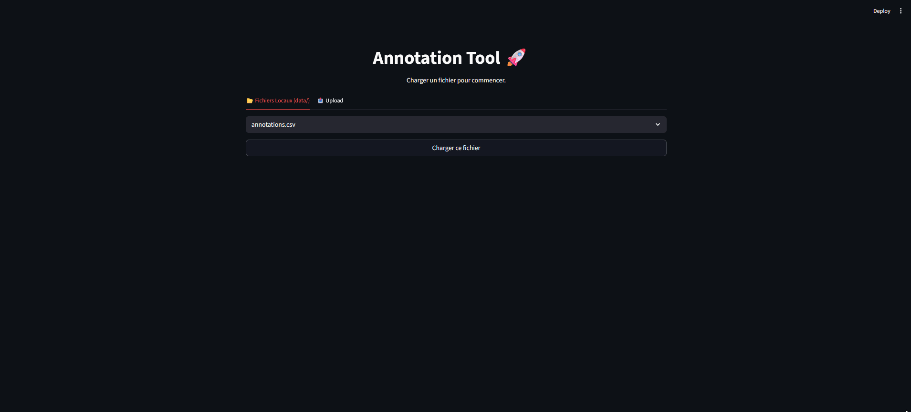
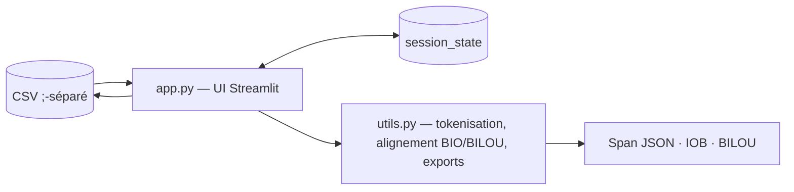

# Service d'Annotation de Texte

Application Streamlit simple et efficace pour l'annotation de texte (NER - Named Entity Recognition) à partir de fichiers CSV.



## Architecture

Application **mono-service** : une interface **Streamlit** ([app.py](app.py)) adossée à un
module de **logique pure** testable indépendamment ([utils.py](utils.py)). Le format pivot
est un **CSV** (séparateur `;`) ; les annotations sont des spans `{start, end, label, text}`
stockés en JSON dans une colonne `annotations`.



> Détails : [docs/ARCHITECTURE.md](docs/ARCHITECTURE.md).

## Documentation

| Document | Contenu |
|---|---|
| [docs/CADRAGE.md](docs/CADRAGE.md) | Le POURQUOI : pitch, périmètre, hypothèses, décisions, roadmap |
| [docs/ARCHITECTURE.md](docs/ARCHITECTURE.md) | Le COMMENT : composants, modèle de données, flux, formats d'export, tests |
| [AUDIT.md](AUDIT.md) | Audit qualité daté (2026-05-08) + roadmap détaillée en 4 phases |
| [QUICKSTART.md](QUICKSTART.md) | Démarrage en 30 secondes |

## Fonctionnalités

*   Chargement de fichiers CSV locaux ou depuis le serveur.
*   Interface d'annotation intuitive avec surlignage coloré.
*   Gestion dynamique des labels.
*   Application globale des annotations (annoter une fois, appliquer partout).
*   Sauvegarde automatique des annotations dans le fichier source.
*   Export CSV.

## Prérequis

*   [Docker](https://www.docker.com/) et [Docker Compose](https://docs.docker.com/compose/)
*   Ou Python 3.12+ + [uv](https://docs.astral.sh/uv/) pour une exécution locale

## Installation et Lancement

### Via Docker (Recommandé)

1.  Cloner ce dépôt.
2.  Lancer le service :
    ```bash
    docker compose up --build
    ```
3.  Accéder à l'application dans le navigateur : [http://localhost:8501](http://localhost:8501)

### En local (Sans Docker)

1.  Installer [uv](https://docs.astral.sh/uv/) si nécessaire :
    ```bash
    curl -LsSf https://astral.sh/uv/install.sh | sh
    ```
2.  Synchroniser les dépendances :
    ```bash
    uv sync
    ```
3.  Lancer l'application :
    ```bash
    uv run streamlit run app.py
    ```

## Utilisation

1.  **Charger un fichier** : Utiliser le panneau de droite pour téléverser un CSV ou en choisir un dans le dossier `data/`.
2.  **Créer des labels** : Dans le panneau de gauche, ajouter des labels (ex: "ORG", "PERS", "LOC").
3.  **Annoter** :
    *   Sélectionner du texte dans la zone de saisie.
    *   Choisir un label.
    *   Cliquer sur "Valider annotation".
    *   L'annotation sera appliquée à toutes les occurrences de ce texte dans le document si possible.
4.  **Naviguer** : Utiliser les boutons "Précédent" et "Suivant" pour changer de ligne.
5.  **Sauvegarde** : Les annotations sont sauvegardées automatiquement dans le fichier CSV chargé (colonne `annotations`).

## Formats d'export

Depuis la barre latérale, choisir un format puis « Générer l'export » et télécharger :

| Format | Fichier | Description |
|---|---|---|
| Span (JSON) | `export_span.json` | Liste `{text, annotations[]}` avec offsets caractères (`ensure_ascii=False`) |
| IOB (CoNLL) | `export_iob.txt` | Un token par ligne `token TAG` (`B-`/`I-`/`O`), ligne vide entre phrases |
| BILOU (CoNLL) | `export_bilou.txt` | Idem IOB, schéma BILOU (`B`/`I`/`L`/`O`/`U`) |

## Configuration

Variables d'environnement du service (définies dans [docker-compose.yml](docker-compose.yml)) :

| Variable | Défaut | Effet |
|---|---|---|
| `STREAMLIT_SERVER_ADDRESS` | `0.0.0.0` | Adresse d'écoute du serveur Streamlit |
| `STREAMLIT_SERVER_PORT` | `8501` | Port d'écoute (mappé sur `8501` de l'hôte) |

Le dossier hôte `./data` est monté sur `/app/data` dans le conteneur (persistance des CSV).

## Structure du Projet

*   `app.py` : UI Streamlit (entrée applicative).
*   `utils.py` : Fonctions pures (chargement, tokenisation, exports BIO/BILOU/JSON).
*   `tests/` : Tests pytest (fonctions pures + smoke test Streamlit).
*   `data/` : Dossier contenant les fichiers CSV à annoter.
*   `pyproject.toml` : Métadonnées projet, dépendances (PEP 621), configuration ruff/mypy/pytest.
*   `uv.lock` : Lockfile reproductible.
*   `Dockerfile` / `docker-compose.yml` : Conteneurisation.
*   `docs/` : Documentation technique (cadrage + architecture).
*   `AUDIT.md` : Audit qualité + roadmap d'évolution.
*   `LICENSE` : Licence MIT du projet.

## Développement

```bash
uv sync --all-groups          # installe runtime + dev deps
uv run pytest                 # tests + couverture
uv run ruff check .           # lint
uv run ruff format .          # format
uv run mypy utils.py          # type-checking
uv run pre-commit install     # hooks git (à faire 1 fois)
```

La CI GitHub Actions ([.github/workflows/ci.yml](.github/workflows/ci.yml)) lance lint, mypy, tests et build Docker à chaque push/PR sur `main`.

## Licences & composants

| Composant | Rôle | Licence |
|---|---|---|
| Streamlit | Interface web | Apache-2.0 |
| pandas | Manipulation de données | BSD-3-Clause |
| st-annotated-text | Rendu des spans annotés | `<à confirmer>` (Apache-2.0 probable) |
| uv | Gestion de dépendances | Apache-2.0 / MIT |
| Python | Runtime (≥ 3.12) | PSF |
| **Ce projet** | Code applicatif | MIT — Copyright (c) 2026 Florian Horellou ([LICENSE](LICENSE)) |
