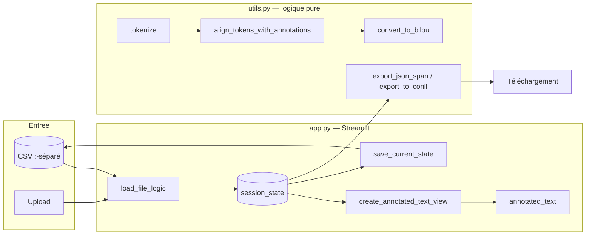

# Architecture — Annotation-Text-Streamlit

> Le **COMMENT** du projet. Le **POURQUOI** (objectifs, périmètre, hypothèses) est
> dans [CADRAGE.md](CADRAGE.md).

## 1. Vue d'ensemble

Application **mono-service** : une interface web **Streamlit** ([app.py](../app.py))
pilotée par un module de **logique pure sans dépendance Streamlit** ([utils.py](../utils.py)).
L'utilisateur charge un **CSV** (séparateur `;`), annote du texte au fil des lignes
(NER — *Named Entity Recognition*), et exporte le résultat en **Span JSON**, **IOB**
ou **BILOU**. Les annotations sont **persistées automatiquement** dans le CSV source.

Le clivage est délibéré : `utils.py` contient les fonctions **testables en isolation**
(chargement, tokenisation, alignement, exports) ; `app.py` ne porte que l'état de session
et le rendu. C'est ce qui rend `utils.py` couvert par des tests unitaires et `app.py`
seulement par un *smoke test* (voir §7).

---

## 2. Composants

| Composant | Fichier | Rôle |
|---|---|---|
| Interface & état de session | [app.py](../app.py) | Landing page, sidebar, navigation, rendu du texte annoté, exports |
| Logique métier (pure) | [utils.py](../utils.py) | `load_csv`, `tokenize`, alignement BIO, conversion BILOU, exports |
| Composant d'affichage | `st-annotated-text` (`annotated_text`) | Surlignage coloré des spans dans le texte |
| Données d'exemple | [data/annotations.csv](../data/annotations.csv) | Corpus de démonstration (recettes de cuisine, labels `action` / `ingrédient`) |
| Conteneurisation | [Dockerfile](../Dockerfile), [docker-compose.yml](../docker-compose.yml) | Image `python:3.12-slim` + `uv`, service exposé sur `8501` |

## 3. Stack technologique

| Couche | Technologie | Version (lue) |
|---|---|---|
| Interface web | Streamlit | `>=1.28.0` |
| Manipulation de données | pandas | `>=2.0.0` |
| Rendu des annotations | st-annotated-text | `>=4.0.0` |
| Runtime | Python | `>=3.12` |
| Gestion de dépendances | uv (+ `uv.lock`) | image `ghcr.io/astral-sh/uv:0.11` |
| Conteneur | Docker / Docker Compose | base `python:3.12-slim` |
| Qualité (dev) | ruff, mypy, pytest, pytest-cov, pre-commit | voir [pyproject.toml](../pyproject.toml) |

---

## 4. Modèle de données

### 4.1 Format d'entrée (CSV)

- **Séparateur** : `;` (imposé par `load_csv`, [utils.py:34](../utils.py#L34)).
- **Colonne texte** : `text` si présente, **sinon la 1ʳᵉ colonne** ([app.py:237](../app.py#L237)).
  ⚠️ `utils.py` utilise systématiquement `row.iloc[0]` ([utils.py:151](../utils.py#L151)) ;
  l'app privilégie `text`. Divergence connue si `text` n'est pas la 1ʳᵉ colonne (voir §8).
- **Colonne `annotations`** : chaîne **JSON** d'une liste d'objets, créée si absente.

### 4.2 Format d'annotation interne (span)

Chaque annotation est un dictionnaire :

```json
{ "start": 6, "end": 15, "label": "action", "text": "chauffer " }
```

`start` / `end` sont des **offsets de caractères** dans le texte de la ligne. Une cellule
`annotations` contient la liste JSON de ces objets (ou une chaîne vide si aucune).

### 4.3 Persistance

`save_current_state()` ([app.py:38](../app.py#L38)) sérialise l'état de session vers la
colonne `annotations` et **réécrit tout le CSV** (`sep=";"`) à chaque navigation ⬅️ / ➡️
et à chaque validation. Simple, mais coûteux en I/O sur gros fichiers (voir §8).

---

## 5. Flux de bout en bout

1. **Chargement** — landing page : onglet « Fichiers Locaux » (liste des `.csv` de
   [data/](../data/)) ou « Upload ». `load_file_logic` parse les annotations existantes et
   **extrait automatiquement les labels** présents (`extract_unique_labels`), en leur
   affectant une couleur.
2. **Annotation** — l'utilisateur saisit un fragment de texte + choisit un label, puis
   « Valider ». Le fragment est recherché dans **toutes les lignes** du document et
   annoté à **chaque occurrence** ([app.py:262-291](../app.py#L262-L291)) — « annoter une
   fois, appliquer partout ».
3. **Rendu** — `create_annotated_text_view` découpe le texte en segments (texte brut /
   span coloré) passés à `annotated_text`.
4. **Navigation** — boutons ⬅️ / ➡️ ; chaque changement déclenche une sauvegarde.
5. **Export** — sidebar : choix du format → sérialisation → bouton de téléchargement.



---

## 6. Formats d'export

| Format (UI) | Fonction | Fichier produit | MIME | Contenu |
|---|---|---|---|---|
| Span (JSON) | `export_json_span` | `export_span.json` | `application/json` | Liste `{text, annotations[]}`, `indent=2`, `ensure_ascii=False` |
| IOB (CoNLL) | `export_to_conll(df, "IOB")` | `export_iob.txt` | `text/plain` | 1 token/ligne `token TAG`, ligne vide entre phrases |
| BILOU (CoNLL) | `export_to_conll(df, "BILOU")` | `export_bilou.txt` | `text/plain` | Idem IOB, schéma BILOU |

**Chaîne de conversion span → CoNLL** :

1. `tokenize` — regex `[\w']+|[.,!?;]` : mots (avec apostrophe) + ponctuation simple.
2. `align_tokens_with_annotations` — attribue un tag **BIO** à chaque token :
   `B-LABEL` si le token commence sur `start` d'une annotation, `I-LABEL` s'il est
   strictement à l'intérieur (`start > a_start` et `end <= a_end`), sinon `O`.
3. `convert_to_bilou` (BILOU uniquement) — post-traitement : `B` seul → `U`, `I` final
   → `L`, via un découpage **strict** du tag (`_split_tag`) qui distingue deux labels
   partageant un suffixe (ex. `LOC` vs `PERS_LOC` — régression testée).

---

## 7. Tests & CI

| Niveau | Fichier | Ce qui est prouvé |
|---|---|---|
| Unitaire (logique pure) | [tests/test_utils.py](../tests/test_utils.py) | `load_csv`, `tokenize`, `extract_unique_labels`, alignement BIO, BILOU, exports Span/IOB/BILOU, cas limites (JSON invalide, unicode, labels à suffixe partagé) |
| Smoke UI | [tests/test_app_smoke.py](../tests/test_app_smoke.py) | Démarrage sans exception + landing page (via `streamlit.testing.v1.AppTest`) |

Couverture mesurée sur `utils` uniquement (`--cov=utils`, `app.py` exclu — voir
[pyproject.toml](../pyproject.toml)). La CI
([.github/workflows/ci.yml](../.github/workflows/ci.yml)) enchaîne `ruff format --check`,
`ruff check`, `mypy utils.py`, `pytest`, puis un **build Docker** (sans push) sur `push` /
`pull_request` vers `main`.

---

## 8. Décisions d'architecture

- **Logique pure isolée dans `utils.py`** **plutôt que** tout mélanger dans `app.py`,
  **parce que** Streamlit rend le code difficile à tester unitairement (état global,
  rerun). *Limite* : la fonction d'application globale d'une annotation est **dupliquée**
  dans [app.py:262-291](../app.py#L262-L291) au lieu d'être dans `utils.py`.

- **Persistance = réécriture complète du CSV à chaque action** **plutôt que** sauvegarde
  incrémentale / base de données, **parce que** le format d'échange reste un simple CSV
  lisible et versionnable. *Limite* : I/O lourd, lent au-delà de ~1000 lignes (identifié
  P1-4 dans [AUDIT.md](../AUDIT.md)).

- **Sélection par copier-coller d'un fragment texte** **plutôt que** sélection souris
  native, **parce que** Streamlit n'expose pas nativement la sélection dans le DOM.
  *Limite* : friction UX majeure (P2-1 dans l'audit) ; un composant custom JS serait
  nécessaire.

- **Application globale de l'annotation à toutes les occurrences** **plutôt que**
  annotation ligne par ligne, **parce que** sur un corpus répétitif (ex. recettes) cela
  évite de ré-annoter le même terme. *Limite* : action **irréversible**, sans preview ni
  undo (P1-3).

- **Échappement HTML des labels** (`html.escape`, [app.py:190-195](../app.py#L190-L195))
  **plutôt que** rendu brut, **parce que** les labels sont injectés dans du HTML via
  `unsafe_allow_html=True` (risque XSS en multi-utilisateur). *Limite* : mitige, mais
  l'usage de `unsafe_allow_html` reste un vecteur à surveiller.

---

## 9. Sécurité (récapitulatif)

| Durcissement | État | Effet |
|---|---|---|
| Conteneur non-root | ✅ `USER app` ([Dockerfile](../Dockerfile)) | Réduit la surface en cas de compromission |
| Healthcheck | ✅ sonde `/_stcore/health` | Compose détecte un service mort |
| Échappement des labels | ✅ `html.escape` | Atténue l'XSS via labels utilisateur |
| `.env` / secrets | 🔲 aucune auth dans le code actuel | L'app est **single-user local** ; pas de gestion de secrets (l'`.env` historique a été retiré — voir [AUDIT.md](../AUDIT.md) P0-1) |
| Isolation réseau | 🔲 port `8501` exposé sur l'hôte | À placer derrière un reverse-proxy si exposition publique |

> Pas de fichier `SECURITY.md` dédié : l'app est mono-service et sans authentification.
> Les points de sécurité historiques sont tracés dans [AUDIT.md](../AUDIT.md).

---

## 10. Limites connues & pistes

| Aspect | Limitation / État | Recommandation |
|---|---|---|
| Colonne texte | `iloc[0]` (utils) vs `text` (app) — divergence | Sélecteur explicite de colonne au chargement (P2-2) |
| Persistance | Réécriture CSV synchrone à chaque action | Sauvegarde à la sortie / bouton dédié + indicateur (P1-4) |
| Undo | Aucun | Historique 1 niveau minimum (P1-3) |
| Tokenizer | Regex naïve (tirets, unicode complexe) | spaCy ou tokenizer dédié (P2-5) |
| Sélection texte | Copier-coller manuel | Composant custom souris (P2-1) |

> Le détail chiffré et priorisé de la dette technique vit dans [AUDIT.md](../AUDIT.md)
> (audit daté du 2026-05-08). Ce document n'en est qu'un renvoi.
